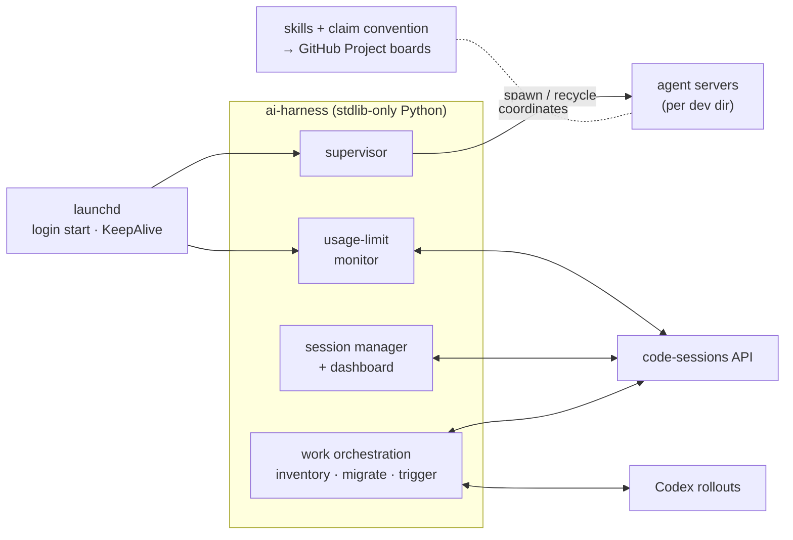

# ai-harness

**A control plane for running AI coding agents as a fleet.**

ai-harness keeps a small army of AI coding agents (Claude Code + Codex) alive,
unblocked, coordinated, and observable across two Macs — so long-running,
multi-session, cross-machine agent work actually finishes instead of silently
stalling. It's a single, **dependency-free Python package** (runs on the system
`/usr/bin/python3`, no venv, no pip) plus a set of version-controlled agent
*skills* and shared environment pools.

> ~8,200 lines of stdlib-only Python · **566 unit tests** · 2 always-on
> LaunchAgents · 10 agent skills · cross-engine (Claude Code + Codex) · built in
> ~8 days.

---

## Why this exists

Running one AI coding session is easy. Running *many*, seriously, is an
operations problem:

- **Servers crash and hang.** The per-directory agent servers die, or wedge
  while idle, and nothing brings them back.
- **Sessions stall on cloud limits for hours.** A session hits a usage/session
  limit and just sits there until someone notices and clicks "continue."
- **Agents block waiting on a question** — and a parallel agent has no idea.
- **Parallel agents collide** on the same ticket, or one dies mid-task and
  strands it.
- **Work scatters across two engines** (Claude Code *and* Codex), two machines,
  and the cloud, with no single view of what's running where.

ai-harness is the layer that handles all of that — the unglamorous
infrastructure that turns "I started an agent" into "the work gets done, even
when I'm not watching."

## What it does

| System | What it gives you |
|---|---|
| **Always-on supervisor** | One `claude remote-control` server per dev dir, supervised by launchd: crashed servers respawn within a tick, idle-hung ones are recycled, and which dirs run is driven by a host-scoped allowlist you edit in git. |
| **Usage-limit auto-resume** | A monitor that detects sessions paused on a cloud usage/session limit (via the code-sessions API) and resumes them automatically, with limit-type-aware backoff — no more sessions parked for hours. |
| **Autonomous session manager** | Classifies *every* session into an actionable state (waiting on a question / idle-maybe-done / broken / limit-paused / running) and plans the fix, with a headless investigator that reads structured questions and picks an answer — plus a local dashboard with a human-in-the-loop feedback loop. |
| **AI permission gate** | A `PreToolUse` hook that auto-decides **allow / deny / ask** for each tool call — static rules for the clear-cut cases plus an AI tier for the ambiguous middle — against the *same* stakes policy the session manager uses. Shadow-first, and fail-safe to a human prompt on any error. |
| **Cross-engine work orchestration** | One unified view of all work across Claude Code **and** Codex — inventory it, detect what's genuinely stuck (and why), migrate threads between engines, or trigger a fresh run. |
| **Multi-agent coordination** | A claim convention + skills (`start-work → resume-work → close-work`) so parallel agents on two machines don't double-work a ticket, and a disconnected agent's work can be reclaimed. |
| **Shared environment pools** | Lease-table-coordinated preview and isolated-test-DB pools — config-driven (BYO app via [`scripts/pool/config.example.yaml`](scripts/pool/config.example.yaml)), so concurrent sessions can run branches without spinning up heavy per-task stacks or clobbering the shared dev database. |

## Architecture at a glance



A full system-by-system breakdown — design principles, data flows, the
pure/impure test seam, and the integration points — is in
**[docs/ARCHITECTURE.md](docs/ARCHITECTURE.md)**.

## Engineering highlights

The parts I'd point a reviewer at:

- **Stdlib-only, runs unattended.** Zero third-party dependencies; boots from
  launchd's bare environment on the OS-bundled Python. No venv to break, nothing
  to `pip install` before a service can come up at login.
- **Pure logic split from side effects → fast, mock-free tests.** Every
  module separates *what to decide* from *what to touch*, so classification,
  backoff schedules, spawn decisions, and request-building are unit-tested
  against plain values — no network, clock, filesystem, or launchd required.
- **Dry-run by default for anything outward-facing.** Resuming a cloud session,
  answering a live question, triggering a run, migrating work — all print exactly
  what they'd do and change nothing until you pass `--write` / `--go` /
  `DRY_RUN=0`.
- **Fail-closed.** A missing/typo'd allowlist means "spawn nothing," never
  "spawn everything."
- **One git repo drives two machines.** Per-host config (which dirs are active,
  who owns which work) is expressed in the shared repo with host scoping; local
  runtime state stays out of git.
- **API reverse-engineering done carefully.** Auth via the macOS keychain
  (token never logged); pause detection is a precise signal conjunction that
  ignores unrelated failures; the design doc records *why* the obvious
  local-transcript approach doesn't work.
- **Honest about its limits.** The docs explicitly call out what isn't handled
  and what's assumed-but-unverified, instead of implying full coverage.

## Repo map

```
remote_control/        # the service package (stdlib-only)
  supervisor.py          # spawn/recycle one agent server per allowlisted dir
  usage_limit/           # detect + auto-resume usage-limit pauses (API-based)
  manager.py             # autonomous session classifier + planner
  manager_ui.py          # local review dashboard (http.server) + feedback loop
  perm_gate.py           # PreToolUse hook: allow/deny/ask (static rules + AI tier)
  inventory.py           # `work` / `work stale` — cross-engine inventory
  work_move.py           # `work move` — migrate work between engines
  work_start.py          # `work start` — trigger a fresh run (dry-run default)
  session_port/          # Codex rollout ⇄ Claude session conversion
  session_list.py        # `sessions` — live inventory (repo + host)
  session_titles.py      # `titles` — nickname-prefix grouping
  session_fork.py        # `fork` — clone a session locally
  installer.py           # launchctl bootstrap (pure cmd construction + runner)
  config.py / discovery.py / procutil.py / logging_util.py
skills/                # 10 version-controlled agent skills (single source of truth)
scripts/pool/          # shared preview + isolated-test env pools (config-driven)
  config.example.yaml    # BYO-app integration surface (copy + edit)
  adapters/              # per-stack adapter scripts (`laravel-docker` ships)
tests/                 # stdlib unittest suite (566 tests)
docs/                  # architecture, operations, and design docs
```

CLI entry point for everything:

```sh
python3 -m remote_control <supervisor|usage-monitor|manager|manager-ui|perm-gate|install|codex-import|titles|sessions|work|fork>
```

## Configure your apps

The harness ships project-agnostic: the supervisor, monitors, manager, and
perm-gate don't know or care what your apps are. The one place you tell it
about your apps is the **environment pool config** — a single YAML that names a
*stack adapter*, your local container/DB conventions, slot layout, and paths.

- Template: [`scripts/pool/config.example.yaml`](scripts/pool/config.example.yaml).
- Copy it to `scripts/pool/config.local.yaml` (gitignored) or point
  `$AI_HARNESS_POOL_CONFIG` at a copy outside the repo. The public repo does
  **not** ship per-user pool configs.
- Today the only shipped adapter is `laravel-docker` (a Laravel + Docker
  Compose dev loop). Adding another stack means dropping a new pair of scripts
  into `scripts/pool/adapters/` and selecting it with `adapter: <name>` in
  the config.

The harness assumes a Docker-Compose-style local dev loop and isn't a
general-purpose CI system. The full runbook is in
[docs/OPERATIONS.md](docs/OPERATIONS.md#configure-your-apps).

## Documentation

| Doc | What's in it |
|---|---|
| **[docs/ARCHITECTURE.md](docs/ARCHITECTURE.md)** | System design: principles, each subsystem, data flows, the test seam, integration points. |
| **[docs/OPERATIONS.md](docs/OPERATIONS.md)** | Runbook + full CLI reference: install, manage, every command, tunables, the activation list. |
| **[DECISIONS.md](DECISIONS.md)** | Cross-repo engineering decisions (`GD-NNNN`) — the conventions that span more than one repo. |
| **[docs/usage-limit-monitor-v2.md](docs/usage-limit-monitor-v2.md)** | Deep dive on the usage-limit monitor and why the local-transcript (v1) approach was abandoned. |
| **[docs/session-manager-cases.md](docs/session-manager-cases.md)** | The session-manager case catalog, decision guidelines, and testing strategy. |
| **[docs/perm-gate.md](docs/perm-gate.md)** | The AI permission gate: the two-tier decision model, shadow-mode rollout, and config. |
| **[skills/README.md](skills/README.md)** | The skills and the multi-agent claim convention. |
| **[scripts/pool/README.md](scripts/pool/README.md)** | The shared environment pools (preview + test). |

## Status

Actively used. The supervisor and usage-limit monitor run live; the autonomous
session manager runs in **review/dry-run mode** while one open question (how to
submit a structured answer back over the API) is resolved — see
[docs/session-manager-cases.md](docs/session-manager-cases.md). Everything that
takes an outward-facing action is gated behind an explicit opt-in by default.

## Tests

```sh
python3 -m unittest discover -s tests -t .
```

Stdlib `unittest`, no third-party deps, runs on `/usr/bin/python3`.

## Secret-scan pre-commit hook (optional)

CI runs gitleaks on every push/PR (`.github/workflows/secret-scan.yml`). To
catch secrets *before* they leave your machine, enable the matching local hook:

```sh
brew install pre-commit && pre-commit install
```
