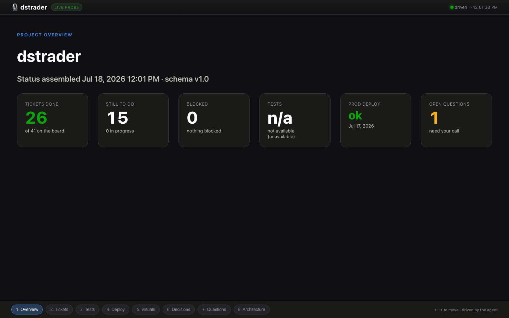
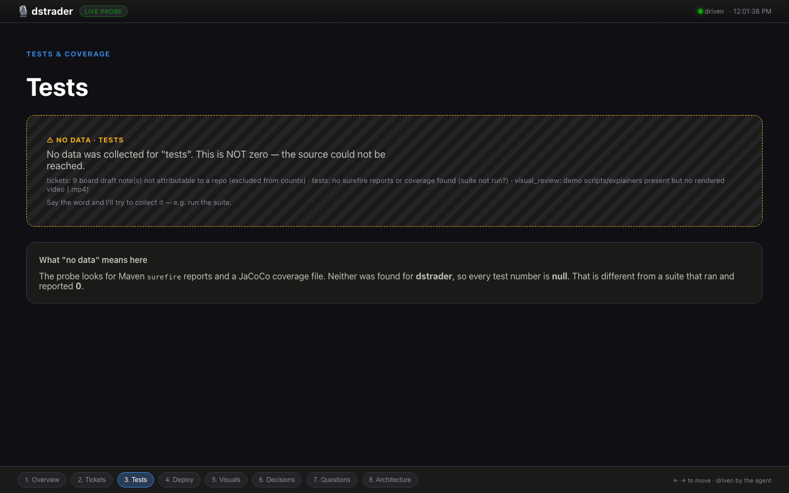

# cos-console · surface (Wave 2)

The **visual half** of the chief-of-staff: a local, server-driven React PWA that
renders a `StatusReport` (from W0's data plane) as a **walkable deck** on both a
desktop big-screen and a phone. The voice-brain will later push "show slide N /
show the coverage chart" over a websocket; this POC models that server-driven
protocol and drives it from a small local Node server that reads the probe
output.



## Quick start

Needs **Node ≥ 18** (built/tested on Node 22). If you use `nvm`:

```bash
nvm use 22            # or: export PATH="$HOME/.nvm/versions/node/v22.11.0/bin:$PATH"
cd ~/dev/cos-console/surface
npm install
npm run dev           # server on :8787, web on :5173 (concurrently)
```

Open **http://localhost:5173**. On the same LAN, open that URL on your phone too
(run `npm run web -- --host` to expose Vite) — both screens mirror the same
server-driven deck.

### Drive it (stand-in for the voice-brain)

The deck is **server-driven**: the browser never decides which slide shows — the
server does, and every connected surface mirrors it. Push intents with the CLI:

```bash
node server/drive.js goto tests        # jump to the tests slide (by widget)
node server/drive.js goto 3            # jump by index
node server/drive.js show coverage     # widget alias -> tests slide
node server/drive.js next | prev
node server/drive.js project familyfund # switch data source, reload
node server/drive.js reload            # re-run the probe
node server/drive.js script            # scripted walk-through (a fake CoS talk)
```

…or hit the control endpoint directly (this is exactly what the brain will do):

```bash
curl -XPOST localhost:8787/control -H 'content-type: application/json' \
     -d '{"type":"goto","widget":"tests"}'
```

Keyboard `←/→` (or the filmstrip) also works — local nav is sent **up** to the
server as an intent so all surfaces stay in lockstep.

## Data source

Pulls the **real** `StatusReport` by shelling out to W0's probe (no secrets, pure
stdlib):

```
python3 -m status_mcp.probe <project> --pretty
```

If the probe can't run, the server falls back to a captured fixture in
`fixtures/` so the deck still renders offline — the top bar shows a **live
probe** vs **fixture** badge either way. Force fixtures with `SURFACE_FIXTURE=1`.

Projects: `dstrader` (primary demo), `familyfund`, and `demo` (a synthetic
fixture with **live** test data, so you can see the Recharts chart path — the two
real projects currently report tests as `unavailable`).

## Anti-fabrication (the core requirement)

Every slide reads the top-level `availability` map **before** rendering any
number. When a section is `unavailable`/`partial` (numeric fields `null`), it
renders an explicit **"no data" panel** — never a zero-value chart. On `dstrader`,
tests are `unavailable`, so the Tests slide shows a hatched "NO DATA · this is NOT
zero" panel instead of a "0 tests" bar. `null` means "we couldn't look"; `0`
means "we looked and there are zero" — the deck never conflates them.



## The slides

| # | id | shows | no-data behaviour |
|---|----|-------|-------------------|
| 1 | overview | project + KPI tiles (tickets/tests/deploy/questions) | per-tile "—" / "n/a" |
| 2 | tickets | burn stacked bar + item list | NoData panel |
| 3 | tests | Recharts outcomes + coverage meter | NoData panel |
| 4 | deploy | prod status / last deploy / commit | NoData panel |
| 5 | visuals | visual-review artifacts | NoData panel |
| 6 | decisions | decisions timeline | NoData panel |
| 7 | questions | open questions for the operator | (empty = "nothing outstanding") |
| 8 | architecture | Mermaid four-plane diagram | text fallback |

## Server-driven protocol

The brain (or the driver CLI) emits **intents**; the server holds the
authoritative `{project, slideIndex}` and broadcasts state over the websocket:

```jsonc
{ "type": "goto",  "slide": 3 }              // by index
{ "type": "goto",  "widget": "tests" }       // by widget alias (coverage, board, prod, …)
{ "type": "show",  "widget": "coverage" }    // alias of goto
{ "type": "next" } | { "type": "prev" }
{ "type": "project", "project": "familyfund" }
{ "type": "reload" }
```

Widget aliases live in `server/deck.js` (`coverage→tests`, `board→tickets`,
`prod→deploy`, `diagram→architecture`, …) so the brain can speak loosely.

## Layout

```
server/     driver server (express + ws), probe runner, deck manifest, drive CLI
src/        React PWA — App, useDeck (ws mirror), slides/, components/
fixtures/   captured probe JSON (offline fallback + demo)
public/     PWA icons + manifest
```

## PWA / responsive

`vite-plugin-pwa` generates the manifest + service worker (`npm run build` then
`npm run preview` for the installable build). The layout is dark-first and
responsive: two-column cards collapse to one column and the filmstrip scrolls
under 640px. Verified in headless Chromium at 1440×900 and 390×844.

Colors follow the operator's **dataviz** skill: validated categorical + status
palettes (dark-surface steps), status reserved for good/warning/critical, direct
labels on bars, one axis, no rainbow.
