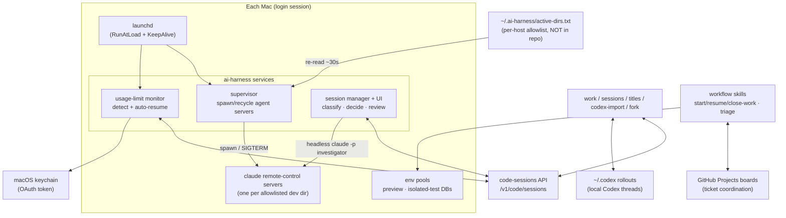

# Architecture

How **ai-harness** is built and why. This is the system-design companion to the
[README](../README.md) (the overview) and [OPERATIONS.md](OPERATIONS.md) (the
runbook + full CLI). Cross-repo conventions referenced here are logged in
[DECISIONS.md](../DECISIONS.md) (`GD-NNNN`).

## Context

ai-harness is a **control plane for AI coding agents** running on two personal
Macs. It supervises long-running agent servers, unblocks sessions that stall on
cloud usage limits, inventories and migrates work across two agent engines
(Claude Code and Codex), and gives a fleet of parallel agents a way to
coordinate on shared work — all from one small, dependency-free Python package
plus a set of version-controlled skills.



## Design principles

These recur across every subsystem and are the spine of the codebase.

1. **Stdlib-only, runs on the system interpreter.** The whole package imports
   nothing outside the Python standard library and runs on macOS's bundled
   `/usr/bin/python3`. No venv, no `pip install`, no lockfile. This is a
   deliberate constraint: the services launch from launchd's bare boot
   environment, where a venv or a missing dependency is one more thing that
   breaks a service that has to come up unattended at login.

2. **Pure decision logic split from side effects.** Every module separates the
   functions that compute *what to do* (classification, backoff schedules, spawn
   decisions, prompt/request construction, rendering) from the functions that
   *touch the world* (spawn a process, POST to the API, read the keychain, write
   state). The pure half takes plain values and returns plain values, so it is
   unit-testable without a real filesystem, clock, network, or launchd — which is
   how 566 tests run in well under a second with zero mocking infrastructure
   beyond injected seams.

3. **Dry-run by default for anything outward-facing.** Resuming a paused cloud
   session, answering a question on a live session, triggering a fresh agent
   run, converting/migrating work, renaming sessions, force-removing a server —
   all of these are hard to undo or visible outside this machine, so they
   **default to printing exactly what they would do and changing nothing.** You
   opt into the real action with `--write` / `--go` / `DRY_RUN=0`. The supervisor
   is the one exception (its whole job is to keep servers running), and even it
   never kills a server doing in-flight work on a guess.

4. **Fail-closed, not fail-open.** If the allowlist file is missing or
   unreadable, the supervisor treats *nothing* as allowed and tears running
   servers down — a typo can never silently mean "spawn a server in every
   directory." Auth failures skip a cycle rather than retrying blindly.

5. **One git repo, many hosts.** Configuration that differs per machine
   (which dirs are active, which host owns which work) is expressed *in the
   shared repo* with host scoping, so the same checkout drives two Macs without
   per-host edits. Runtime state that must stay local (lease tables, logs,
   per-host DBs) is kept out of git.

6. **Honest about its limits.** The docs call out what is *not* handled and what
   is assumed-but-unverified (hung-but-alive servers, clean-deregister-on-reboot,
   the unresolved answer-submission shape) rather than implying full coverage.
   Knowing the boundary is part of the design.

## Subsystems

### 1. Remote-control supervisor

**Files:** `supervisor.py` (tick loop), `discovery.py` (dir discovery +
allowlist, pure), `procutil.py` (spawn / adopt-by-pid / signal / capacity-read
seam), `installer.py` (launchctl bootstrap, pure command construction + runner).

A LaunchAgent runs the supervisor at login and `KeepAlive`s it. Each tick
(default 30s) it:

1. **discovers** candidate dirs under the dev root,
2. filters them through the **host-scoped allowlist** (`~/.ai-harness/active-dirs.txt`, per-host, not in the repo),
3. **ensures** exactly one `claude remote-control` server per allowed dir —
   adopting an already-running one by PID rather than killing and respawning,
4. **idle-recycles** a server that has reported zero capacity continuously for
   `IDLE_RECYCLE_SECS` (default 12h), which bounds how long an *idle* hung server
   can persist without ever touching one doing real work.

Spawn mode is chosen per dir (the dev root spawns in place; git subdirs spawn in
worktree mode). Because the LaunchAgent does **not** set `AbandonProcessGroup`,
launchd SIGTERMs the supervisor at logout/reboot and its handler forwards SIGTERM
to every child server, giving each a chance to deregister from the cloud before
exit. The allowlist is re-read every tick, so enabling/disabling a dir takes
effect within one tick with no restart. Full behavior and the deliberate
non-goals are in [OPERATIONS.md](OPERATIONS.md#remote-control-supervisor).

### 2. Usage-limit auto-resume monitor

**Files:** `usage_limit/detect.py` (detection filter, reset-time parsing,
backoff schedule, target selection — all pure), `usage_limit/monitor.py`
(keychain auth, API client, state/lock, the detect/resume loop).

A separate LaunchAgent that notices when a session has stalled on a cloud
usage/session limit and nudges it back to life. The key architectural decision
was **talking to the code-sessions API, not local transcripts**: the local JSONL
session id is a *different conversation* from the cloud/bridge session (`cse_…`)
the app shows, so resuming the local uuid never touches what the user sees, and
live bridged pauses often aren't written to local JSONL at all. Only the API
sees and can resume the real sessions. (The earlier JSONL engine is retired; the
[v2 design doc](usage-limit-monitor-v2.md) records exactly why.)

It reads the OAuth token from the macOS keychain each cycle (never logged),
detects a pause via a precise signal conjunction (`status == active` &&
`worker_status == idle` && a `post_turn_summary` that *failed* on a
usage/session-limit detail, excluding unrelated failures), and resumes by POSTing
a user turn — confirming success by re-fetching the session. Backoff is
limit-type-aware: a 5-hour session limit carries its own reset time and is
retried just after it; a monthly limit (no reset time) backs off on a capped
schedule. State is persisted (keyed by `cse_` id) so attempts and backoff survive
a launchd respawn.

### 3. Autonomous session manager + dashboard

**Files:** `manager.py` (classify → plan → act, with pure helpers above an
I/O `main`), `manager_ui.py` (a stdlib `http.server` review dashboard).

The most exploratory subsystem: a step beyond *reacting to one failure mode*
(usage limits) toward *shepherding every session*. It reuses the same API and
the same detectors, classifies each session into one **actionable case**, and
plans the matching action:

| Case | Signal | Planned action |
|---|---|---|
| **Waiting on a question** | `worker_status == requires_action` | Read the structured question, run a headless `claude -p` **investigator** in the repo's *main* checkout (read-only) to pick the best option, submit the choice. |
| **Idle, maybe done** | idle past a grace, connected, not limit-paused | Investigator reviews the work → recommend `/close-work` or propose the next step. |
| **Broken / stale** | `connection_status == disconnected` past a grace | Fork the session → resume on the fork → archive the original. |
| **Usage-limit paused** | limit `post_turn_summary` | **Defer** — the usage-limit monitor owns it. |
| **Running / too-recent** | `running`, or inside its grace | **Skip** — a quiet `running` worker is indistinguishable from a long tool call. |

Every action is guarded by **grace** (the state must persist before acting),
**cooldown** (don't re-act on the same session too soon), and a
**max-actions-per-tick** cap. The whole thing is **dry-run by default**, and only
the answer path is wired for live action; rescue/review still print their plan.

The honest blocker is documented: *how* you submit a choice to an
`AskUserQuestion` over the API isn't solved yet (two shapes tried, both returned
`200` but didn't resolve the session), so live submission stays gated off. The
`manager-ui` dashboard turns that uncertainty into a **human-in-the-loop feedback
loop**: it shows every stuck thread with its reason, runs the investigator with
the *current guidelines as policy*, caches the analyses, and lets you give
free-text feedback and edit the guidelines doc in place — which feeds the next
analysis. The case catalog, the guideline blocks, and the testing strategy
(deterministic classification tests + offline investigator *replay* against saved
scenarios) are in [session-manager-cases.md](session-manager-cases.md). The
manager's **in-session counterpart is the AI permission gate** (subsystem 7
below): one shared stakes policy, two enforcement points — the out-of-band
manager that answers paused sessions, and the in-process gate that pre-empts
routine permission prompts.

### 4. Cross-engine work orchestration

**Files:** `inventory.py` (`work` / `work stale`, unified Claude+Codex inventory
+ stale-detect), `work_move.py` (`work move`), `work_start.py` (`work start`),
`session_port/` (Codex rollout parsing + Claude session JSONL construction),
`session_fork.py` (`fork`), `session_list.py` (`sessions`), `session_titles.py`
(`titles`).

A coding agent isn't one tool — work happens in both Claude Code and Codex,
locally and in the cloud. This subsystem treats them as one fleet across four
verbs:

- **Inventory** (`work`) — merge Claude sessions (bridge + cloud, from the API)
  and local Codex rollout threads into one table keyed by engine/repo/host, with
  a recency-based active/idle flag.
- **Stale-detect** (`work stale`) — surface only *unambiguously* stuck work
  (usage-limit paused, disconnected, or awaiting a response the agent never gave)
  with the reason. A merely-quiet worker is deliberately *not* flagged.
- **Migrate** (`work move`, `codex-import`) — convert Codex threads into
  resumable Claude Code sessions (the Claude→Codex direction is an app-only
  feature, so that direction only *reports* import status). The converter keeps
  the clean user/agent conversation and drops Codex's reasoning + raw tool
  records, which is what otherwise breaks Claude's resume validation.
- **Trigger** (`work start`) — launch a fresh detached run on either engine from
  a prompt (dry-run by default).

Supporting commands round out session hygiene: `sessions` (live inventory
annotated with repo + host/sandbox), `titles` (bulk nickname-prefixing — the
*only* writable grouping handle the API exposes, since it has no folders and
`tags` is read-only — see `GD-0005`), and `fork` (clone a Claude session into a
local sibling). Full command reference in
[OPERATIONS.md](OPERATIONS.md#cross-engine-work-orchestration).

### 5. Multi-agent workflow (skills + claim convention)

**Files:** `skills/` (10 version-controlled Claude/Codex skills),
`skills/start-work/scripts/agent_claims.sh` (the shared claim helper).

Several agents — parallel Claude/Codex sessions, often across both Macs — share
one set of GitHub Project boards, so two could grab the same ticket or one could
die mid-ticket and strand it. The coordination model is a **claim lifecycle**:

```
start-work (claim)  →  work  →  resume-work (if interrupted)  →  close-work (deliver / hand off)
```

A claim is **GitHub-anchored** (one shared source of truth that syncs across
machines for free): status → *In Progress*, an assignee filter, and a structured
**claim comment** identifying the agent by **worktree path + host** (the reliable
join key). Disconnect detection is **passive**: an agent is "alive" only if its
session transcript was appended within a 1-hour TTL and didn't end on an API
error / usage limit; otherwise its claim is reclaimable. The skills (`list-tickets`,
`start-work`, `resume-work`, `close-work`, plus `list-sessions`, `session-triage`,
`rename-sessions`, `remote-control-dirs`, `lease-env`, `test-env`) all share one
helper script. The skills directory is the **single source of truth** — the
per-tool global skill dirs are symlinks back into the repo, so a skill is edited
once and both engines pick it up (`GD-0003`).

### 6. Shared environment pools

**Files:** `scripts/pool/pool.sh` + `scripts/pool/testpool.sh` (thin
dispatchers), `scripts/pool/pool-core.sh` (lease table + lock + slot math, the
project-agnostic core), `scripts/pool/load-config.sh` + `_yaml_to_env.py`
(YAML → shell vars), `scripts/pool/adapters/<stack>-*.sh` (per-stack glue),
`scripts/pool/config.example.yaml` (the BYO-app integration surface).

Concurrent sessions need somewhere to run a branch without each spinning up a
heavy ad-hoc stack, and without clobbering a shared dev database. Two
**lease-table-coordinated** pools solve this: a **preview pool** of fixed slots
that share the dev DB (for browsing a branch in a browser), and a **test pool**
of slots with private, freshly-restored databases (for `RefreshDatabase`-style
suites, coverage, and parallel test runs that must not touch dev data).

The pool subsystem is **config-driven**: a single YAML
([`config.example.yaml`](../scripts/pool/config.example.yaml)) names an
**adapter** under `scripts/pool/adapters/` and supplies every value that was
previously hardcoded — DB prefix, state dir, container names, compose service
names, slot/offset arrays, baseline backup paths. The dispatchers read the
config (via `$AI_HARNESS_POOL_CONFIG` or `scripts/pool/config.local.yaml`),
load the adapter, and execute it. Only the **`laravel-docker`** adapter ships
today (a Laravel + Docker-Compose dev loop); a different stack means adding
`adapters/<name>-pool.sh` + `adapters/<name>-testpool.sh` and selecting it via
`adapter: <name>`.

The **code is vendored in this repo** and symlinked into the live state dir;
the **runtime state stays per-host** and out of git (`GD-0006`). Agents reach
the pools through the `lease-env` / `test-env` skills so they never collide on
a slot.

### 7. AI permission gate (in-session enforcement)

**Files:** `perm_gate.py` (the `PreToolUse` hook + the two-tier decision), with
the stakes policy shared from `docs/session-manager-cases.md`.

Where the session manager (subsystem 3) acts on sessions *out of band*, the
permission gate acts *inside* a session: it's a Claude Code `PreToolUse` hook
that decides, per tool call, whether to **allow / deny / ask** — so routine-safe
operations stop re-prompting while genuinely risky ones stay gated. It decides in
two tiers:

1. **Static rules** (no model, instant, deterministic): a small deny-list
   (safety-disabling / destructive-at-root), an ask-list (push/merge/reset,
   `sudo`, deploy, secrets, `curl … | sh`), and an allow-list (reads, build,
   test) — a chained command is allowed only if *every* segment is allow-listed.
2. **AI tier**, only for the ambiguous middle the static rules don't cover: one
   `POST /v1/messages` (urllib, no SDK and no `claude -p` spawn, so it can't
   recurse) given the call plus the same stakes policy the manager uses.

It is **fail-safe, never fail-open** — any error, timeout, or unparseable reply
resolves to `ask` (the human prompt), and it always exits 0 so it can never
itself block a tool. Like the manager and the resume monitor, it ships
**shadow-first** (`PERM_GATE_ENFORCE=0`): it logs the decision it *would* make to
`logs/perm-gate-decisions.jsonl` and changes nothing until you review the log and
flip enforcement on. Full decision model, config, and rollout are in
[perm-gate.md](perm-gate.md).

## The pure / impure seam, concretely

Every service module follows the same shape, which is what makes the test suite
fast and mock-free:

```
module.py
├── pure helpers (top of file)        # values in → values out; the decisions
│     classify(...)  backoff(...)  build_request(...)  render(...)
└── main(argv) + injected seams       # the only place that touches the world
      read token · GET/POST · spawn · read/write state · sleep
```

Tests exercise the pure helpers directly with synthetic inputs (a fabricated
session dict, a fixed "now", a saved `requires_action_details`) and assert the
decision — no network, no real clock, no launchd, no filesystem. The I/O `main`
is thin enough to verify with a handful of seam-level tests. The result: **566
tests** across the package's ~8,200 lines, runnable on the same bare
`/usr/bin/python3` the services use.

## Data sources & integration points

| Source | Used for | Notes |
|---|---|---|
| **code-sessions API** (`/v1/code/sessions`) | live session state, pause detection, resume, manager classification | OAuth via keychain; the source of truth the app sees, unlike local JSONL |
| **macOS keychain** | the OAuth token, read per cycle | never logged; kept fresh by the running servers |
| **local Claude transcripts** (`~/.claude/projects/**`) | resume recovery, agent-liveness for claims | a *different* id space from cloud sessions — a key gotcha the design works around |
| **Codex rollouts** (`~/.codex/sessions`) | cross-engine inventory + import to Claude | local JSONL rollout threads |
| **GitHub Projects boards** | ticket tracking + the claim convention | needs the `project` token scope |
| **launchd** | service lifecycle (login start, KeepAlive, clean SIGTERM) | the bare boot environment is why the package is stdlib-only |

## Testing strategy

- **Deterministic, offline unit tests** for all decision logic — one fixture per
  case/row of the behavior tables (classification, backoff, allowlist + host
  scoping, cooldown/grace, spawn decisions, request building, rendering).
- **Offline investigator replay** for the manager's LLM-driven choices: a corpus
  of saved `requires_action_details` scenarios is replayed through the
  investigator without ever touching a live session, so its option choices can be
  eyeballed and curated.
- **Guarded live probes** for the few paths that must hit the real API, behind
  the dry-run gates.

Run the whole suite with `python3 -m unittest discover -s tests -t .`.

## Where decisions live

Cross-repo conventions (boards, worktree-per-task, the claim convention, the
allowlist model, title grouping, env pools, secrets posture) are recorded as
`GD-NNNN` entries in [DECISIONS.md](../DECISIONS.md). Repo-specific reference
docs live alongside this file in [docs/](.).
